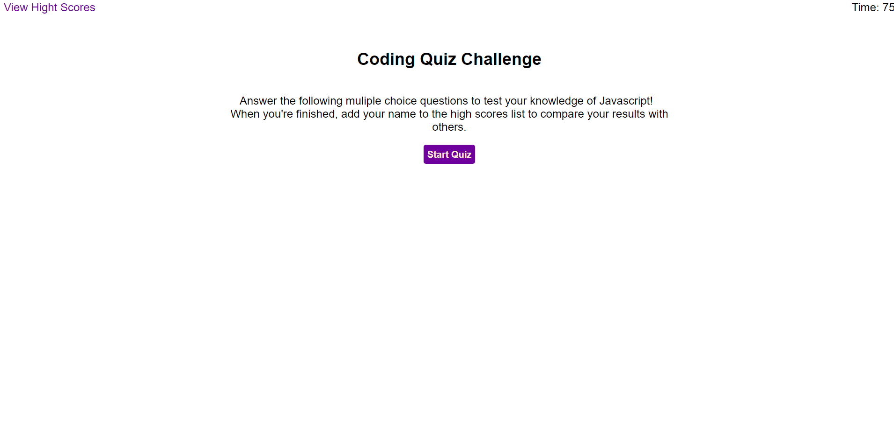

# Coding Quiz
# by_James_Fidlin

[![LinkedIn][linkedin-shield]][linkedin-url]

 

  

  <h3 align="center">Coding Quiz</h3>

  

    <a href="https://jamesf905.github.io/Coding_Quiz/"><strong>https://jamesf905.github.io/Coding_Quiz/</strong></a>
     
     
    <a href="https://www.linkedin.com/in/james-fidlin-98853a239/">linkedin</a>
    ·
    <a href="www.gmail.com">Contact</a>
  

## About The Project

[![Coding Quiz][product-screenshot]](https://jamesf905.github.io/Coding_Quiz/)

This module's challenge requires me to create a quiz game based on Javascript. Users will answer questions within a time limit, and be given a final score that they can add to a high score list. This list can be reset, and the game can be played multiple times by the user. The challenge will showcase alomost everything we have learned during this module.

(<a href="#top">back to top</a>)

### Built With

* [Javascript](https://www.javascript.com/)
* [CSS](https://developer.mozilla.org/en-US/docs/Web/CSS)
* [HTML](https://developer.mozilla.org/en-US/docs/Web/HTML)
* [Visual Studio Code](https://code.visualstudio.com/)
* [Git Hub](https://github.com/)
* [Git Bash](https://git-scm.com/)

(<a href="#top">back to top</a>)

## Contact

James Fidlin - gmail.com

Project Link: [https://github.com/JamesF905/Coding_Quiz](https://github.com/JamesF905/Coding_Quiz)

(<a href="#top">back to top</a>)

[linkedin-shield]: https://img.shields.io/badge/-LinkedIn-black.svg?style=for-the-badge&logo=linkedin&colorB=555
[linkedin-url]: https://www.linkedin.com/in/james-fidlin-98853a239/
[product-screenshot]: images/Project_Screenshot.png
